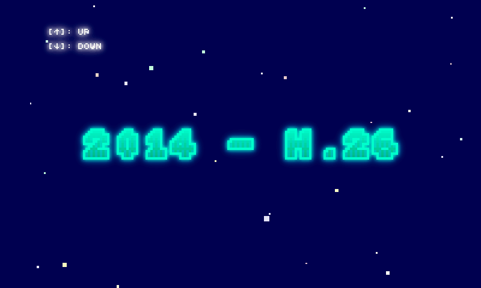

# SEIREKI WAREKI TABLE

SEIREKI WAREKI TABLE is a very useful tool to calculate a year from the Christian calendar to the Japanese calendar.

Using the [mgl](https://github.com/abagames/mgl "mgl") mini game programming library.

## Screenshot

## Blog Post

[inaniwa3's blog](http://inaniwa3.hatenablog.com/entry/2014/08/16/191716 "inaniwa3's blog") (Japanese)
